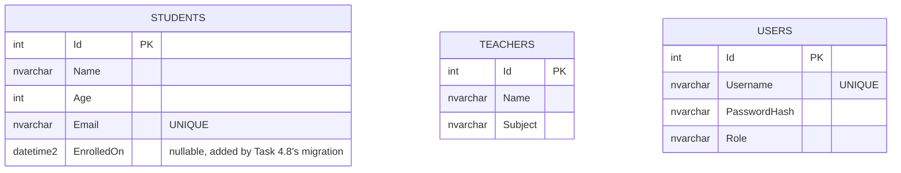

# ER Diagram — Task 4.1

## Normalization (≥3NF)

- **Students** and **Teachers** are independent entities: every non-key
  column (Name, Age, Email / Name, Subject) depends only on that table's own
  Id, not on any other table's key — no partial or transitive dependencies,
  satisfying 2NF and 3NF.
- **Users** is deliberately its own table rather than columns bolted onto
  Students/Teachers. Authentication data (Username, PasswordHash, Role) has
  a completely different lifecycle and access pattern from domain data
  (Students/Teachers get read constantly by app features; Users gets read
  almost only at login) — mixing them would violate the same
  "one table, one purpose" reasoning 3NF is built on, even though nothing
  here technically forces the split at the normal-form level.
- No repeating groups, no derived/calculated columns stored redundantly
  (e.g., no "AgeGroup" column duplicating information already computable
  from Age) — every stored column is a fact about that one entity, once.
- **UNIQUE constraints** on Students.Email and Users.Username are business
  rules layered on top of normalization (Task 4.6's Fluent API index /
  CreateTables.sql's `CREATE UNIQUE INDEX`) — 3NF alone doesn't guarantee
  uniqueness, so these are enforced explicitly.

There is no foreign-key relationship drawn between these three tables on
purpose — this week's domain doesn't yet need one (e.g., no
"Student enrolled in Teacher's class" join table). Nothing above prevents
adding one later; it just isn't required by what Tasks 4.1-4.11 actually
build.
